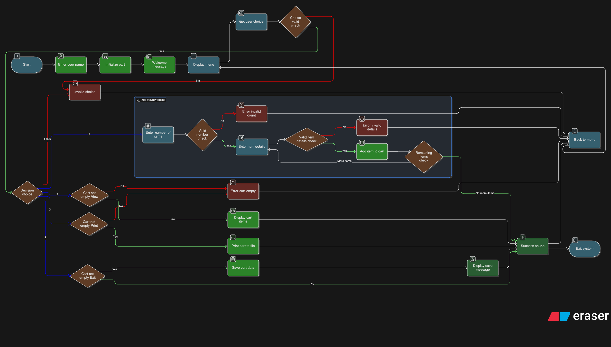

# 🛒 E-Commerce Cart System


## **A simple, feature-rich, and colorful command-line shopping cart experience.**

<div align="center">
  
</div>

## 📝 Overview

The **E-Commerce Cart System** is a python-based CLI tool that simulates a virtual shopping cart. It allows users to browse, add items, manage quantities, and generate professional receipts. Unlike basic scripts, this project features persistent storage using JSON and an engaging user interface with sound effects and color-coded output.

---

## 🌟 Features

| Feature                 | Description                                                            |
| :---------------------- | :--------------------------------------------------------------------- |
| **🛍️ Dynamic Cart**     | Add items with custom Names, Quantities, and Prices.                   |
| **👀 Visual Table**     | View your cart in a clean, aligned table format.                       |
| **🧾 Instant Receipts** | Generate professional text-based receipts in the `Saved Files` folder. |
| **💾 Smart Saving**     | Auto-saves cart history to JSON upon exit for data persistence.        |
| **� Sound Effects**     | feedback sounds for success and error actions (using `playsound`).     |
| **🎨 Modern UI**        | Color-coded terminal output using `termcolor` for a better UX.         |
| **👤 User Profiles**    | Supports Guest mode or personalized User names.                        |

---

## 🚀 Getting Started

Follow these steps to set up the project locally.

### 📋 Prerequisites

Make sure you have Python installed. You will also need to install the following dependencies:

```bash
pip install termcolor playsound
```

_(Note: `playsound` version 1.2.2 or 1.3.0 is recommended for best compatibility)_

### 📥 Installation

1. **Clone the Repository**

   ```bash
   git clone https://github.com/YourUsername/E-Commerce-Cart-System.git
   ```

2. **Navigate to Directory**
   ```bash
   cd E-Commerce-Cart-System/E-cart-system
   ```

### 🎮 Usage

Run the main application script:

```bash
python main.py
```

**Navigate the Menu:**

1. **Add Item**: Enter details as `ItemName, Quantity, Price` (e.g., `Apple, 5, 20`).
2. **View Cart**: See your current selection.
3. **Print Receipt**: Save the current cart as a text file.
4. **Exit**: Save history and close.

---

## 📂 Project Structure

```text
E-Commerce-Cart-System/
├── E-cart-system/            # Source code
│   ├── main.py               # Entry point
│   ├── models.py             # User, Cart, and Sound logic
│   ├── json_savefile.py      # JSON persistence handler
│   ├── audio/                # Sound effect files
│   └── Saved Files/          # Output directory
│       ├── Cart History/     # JSON history logs
│       └── Printed Receipts/ # Generated .txt receipts
└── README.md                 # Documentation
```
## 📂 Complete Detailed Structure

```text
E-Commerce-Cart-System/
    ├── Basic_system/
    │   ├── E-Cart-System-Main.py
    │   ├── Project_Report.pdf
    │   ├── Version 1.0.0.py
    │   ├── Version 2.0.0.py
    ├── E-cart-system/
    │   ├── audio/
    │   │   ├── error.mp3
    │   │   ├── success.mp3
    │   ├── Saved Files/
    │   │   ├── Cart History/
    │   │   │   ├── cart_history-04-01-2026.json
    │   │   │   ├── cart_history-05-01-2026.json
    │   │   ├── Printed Receipts-04-01-2026/
    │   │   │   ├── cart_details_04-01-2026 23-17-53.txt
    │   │   │   ├── cart_details_04-01-2026 23-19-00.txt
    │   │   │   ├── cart_details_04-01-2026 23-24-11.txt
    │   │   │   ├── cart_details_04-01-2026 23-27-16.txt
    │   │   └── Printed Receipts-05-01-2026/
    │   │       └── cart_details_05-01-2026 01-58-05.txt
    │   ├── history_json.py
    │   ├── main.py
    │   └── models.py
    ├── Project_Report.pdf
    └── README.md
```

---

## 👥 Authors

Developed with ❤️ by **Coding Group**:

- **Kruthik BT**
- **Gowtham Gowda C B**
- **Akash B V**
- **Rohith S J**
---

<div align="center">
  
</div>

<div align="center">
  <p>If you find this project useful, please give it a ⭐!</p>
</div>
