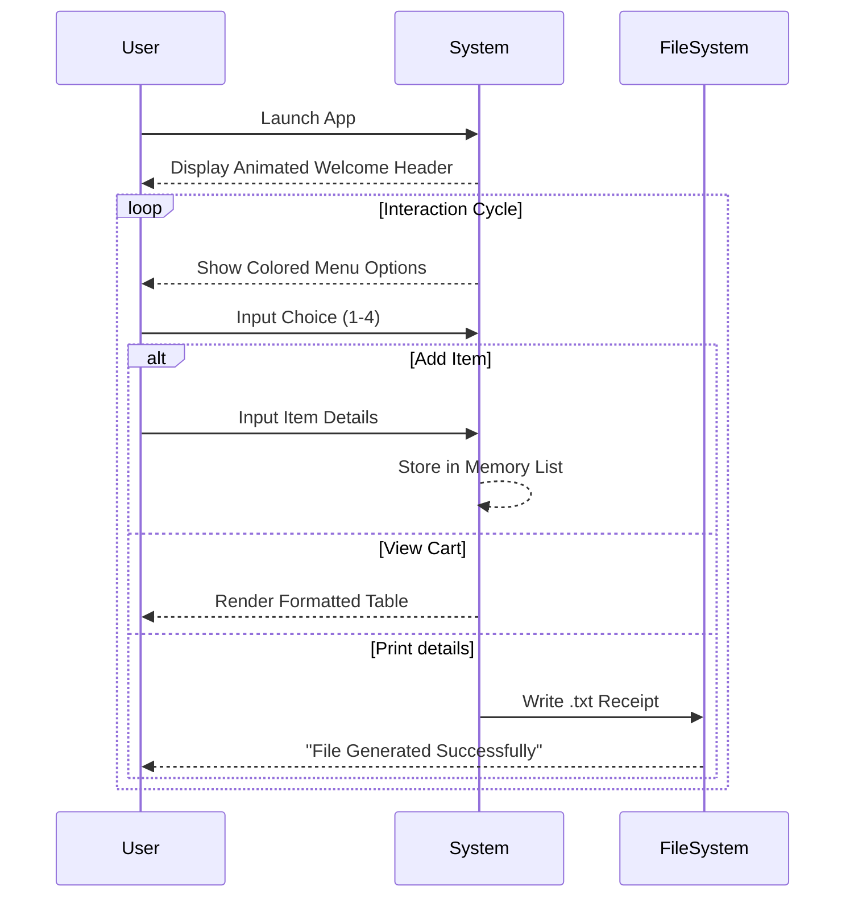
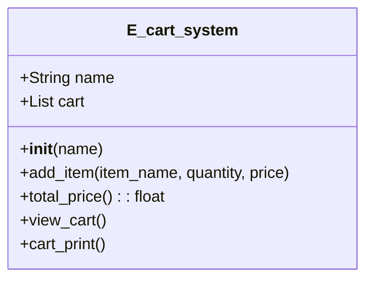

# 🚀 Project Report: E-Commerce Cart System

## 1. Executive Summary

This report presents a comprehensive technical analysis of the **E-Commerce Cart System**, a CLI-based Python application tailored for simulating a transactional shopping environment. The system prioritizes user interaction through colored terminal outputs and persistent record-keeping via generated receipt files.

---

## 2. 🎨 UI/UX & Interaction Design

The application leverages the `termcolor` library to transcend standard console monotony, offering a vibrant **Command Line Interface (CLI)**.

### **Visual Hierarchy & Aesthetics**

- **Brand Identity**: The header utilizes **BOLD RED** text enclosed in borders, instantly establishing a professional app identity.
- **Status Indicators**:
  - <span style="color:green">**Success**</span>: Green text confirms actions (e.g., specific item additions).
  - <span style="color:yellow">**Processing**</span>: Yellow highlights calculations and transitions.
  - <span style="color:red">**Alerts**</span>: Red signifies errors or critical prompts (e.g., Invalid Logic).
  - <span style="color:cyan">**Prompts**</span>: Cyan invites user input, clearly distinguishing system output from user actions.

### **User Flow Animation (Simulated)**

The experience is designed to feel dynamic. Below is a visualization of the interaction loop:



---

## 3. ⚙️ Technical Architecture & Advanced Analysis

### **3.1 Class Diagram**

The system is encapsulated within a robust object-oriented structure.



### **3.2 Algorithmic Efficiency**

- **Data Structure**: `List` of `Lists` `[[name, qty, price], ...]`.
- **Add Item**: $O(1)$ - Appending to the end of a list is a constant time operation.
- **Total Calculation**: $O(n)$ - Iterates through the cart once to sum values.
- **Space Complexity**: $O(n)$ - Linear growth relative to the number of items in the cart.

### **3.3 Robustness & Error Handling**

The application implements defensive programming strategies:

- **Input Sanitization**: `strip()` method cleans user names.
- **Type Safety**: `try-except` blocks guard against `ValueError` when parsing integers/floats for menu selection and price inputs.
- **Logic Validation**: Checks for valid menu integers `[1,4]` and valid quantity inputs.

---

## 4. 📊 Output & Data Persistence

**File Strategy**: The system generates unique, timestamped receipts to prevent overwriting previous records.

### **Sample Artifact: `cart_details_20260102210929.txt`**

The output is formatted as a professional invoice using alignment specifiers (e.g., `:<20` for left-aligning names).

```text
===================================
|        E-COMMERCE RECEIPT       |
===================================
Date: 2026-01-02 21:09:29
User: Guest User
-----------------------------------
Product              Qty   Price
-----------------------------------
apple                2     ₹600.0
===================================
GRAND TOTAL:    ₹1200.00
===================================
```

---

## 5. 🔮 Future Roadmap & Scalability

To transition from a prototype to a production-grade system, the following enhancements are proposed:

1.  **Database Integration**: Migrate from in-memory lists to **SQLite** or **PostgreSQL** for persistent cart storage across sessions.
2.  **GUI Implementation**: Upgrade the frontend to **Tkinter** or **PyQt** for a windowed graphical experience.
3.  **Authentication**: Implement password hashing (SHA-256) for secure user accounts.
4.  **API Microservice**: Refactor the core logic into a **REST API (FastAPI)** to support web and mobile frontends.

---

## 6. Conclusion

The **E-Cart-System** is a solid foundational tool demonstrating core Computer Science concepts: OOP, File I/O, Error Handling, and UX Design. It successfully bridges key logical operations with a user-friendly terminal interface.
